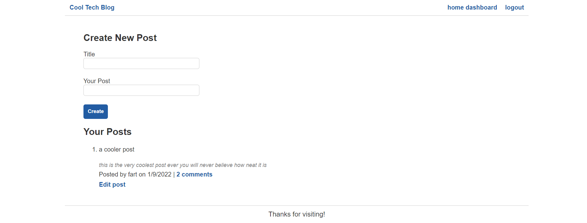

  # Tech Blog
  

  ## Table of Contents:
  * [Description](#description)
  * [Contributors](#contributors)
  * [Questions](#questions)
  
  ## Description:
  Full stack application that allows users to sign up, login, as well as make, edit, and delete posts.
  [deployed site](https://cool-tech-blog-123.herokuapp.com/)
  
  ## Contributors
  Feel free to contribute via opening issues on GitHub.

  ## Tests
  

  ## Questions
  You can reach me for additional questions at:
  * GitHub: [jtboyman](https://github.com/jtboyman)
  * Email: jtboyman@gmail.com